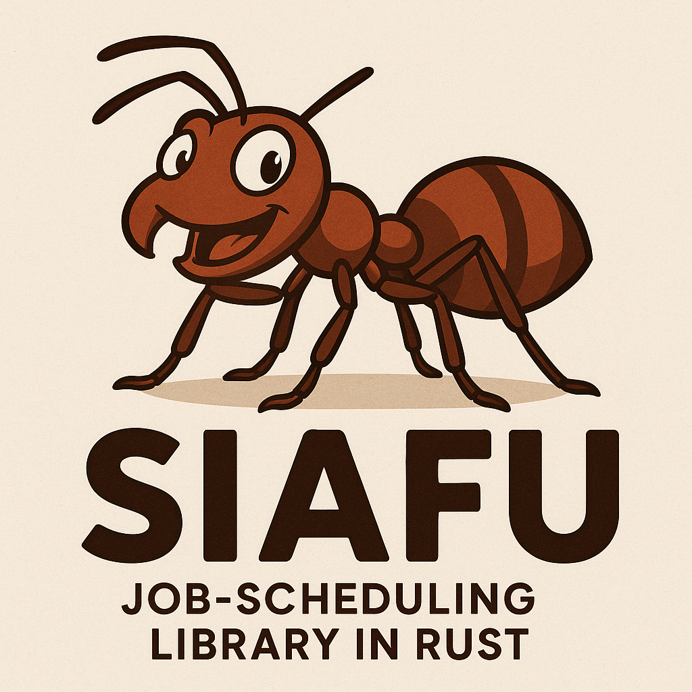

## Ergonomic Job Scheduler Library

<p align="center">
  
</p>

A flexible and ergonomic job scheduling library for Rust applications with an intuitive, fluent public API.

### Why "Siafu"?

The name "Siafu" refers to safari ants (also known as driver ants or army ants), which are famous for their highly organized and efficient colony operations. These fascinating insects:

- Work in perfect coordination with specialized roles for different tasks
- Execute complex operations through distributed intelligence
- Can adapt their scheduling and routing based on environmental changes
- Form living bridges and structures to overcome obstacles

Just like these remarkable ants, the Siafu library excels at organizing, scheduling, and executing tasks in a coordinated manner. The library embodies the efficiency, reliability, and adaptability of safari ants' work patterns, making it the perfect metaphor for a job scheduling system.

### Features

- Schedule tasks to run on:
  - Specific dates/times, e.g., 20 Sept 10:00 pm
  - Recurring intervals, e.g., hourly, daily, weekly, monthly
  - Random intervals, e.g., between 9-10 am
  - Cron expressions for complex scheduling patterns
- Set limits on recurring jobs: hourly 5 times or daily x times, first Friday of every month
- Error handling and job monitoring capabilities
- Fluent builder API for easy job configuration

### Usage Examples

```rust
use siafu::{JobBuilder, Scheduler, ScheduleTime, SchedulerError};
use std::time::{SystemTime, Duration};
use siafu::scheduler::types::RecurringInterval;

fn main() -> Result<(), SchedulerError> {
    let mut scheduler = Scheduler::new();

    // One-time job: run once after 5 seconds
    let job = JobBuilder::new("one-time-job")
        .once(ScheduleTime::Delay(Duration::from_secs(5)))
        .add_handler(|| {
            println!("One-time job executed!");
        })
        .build();
    scheduler.add_job(job)?;

    // Recurring job: every 3 seconds, up to 5 times
    let job = JobBuilder::new("recurring-job")
        .recurring(RecurringInterval::Secondly(3), Some(ScheduleTime::Delay(Duration::from_secs(3))))
        .repeat(5)
        .add_handler(|| {
            println!("Recurring job executed!");
        })
        .build();
    scheduler.add_job(job)?;

    // Cron job: 9 AM on weekdays
    let job = JobBuilder::new("cron-job")
        .cron("0 0 9 * * 1-5 *")
        .add_handler(|| {
            println!("Cron job executed!");
        })
        .build();
    scheduler.add_job(job)?;

    // Random-time job: random time between 5-15 seconds from now
    let start = SystemTime::now() + Duration::from_secs(5);
    let end = SystemTime::now() + Duration::from_secs(15);
    let job = JobBuilder::new("random-job")
        .random(ScheduleTime::At(start), ScheduleTime::At(end))
        .add_handler(|| {
            println!("Random-time job executed!");
        })
        .build();
    scheduler.add_job(job)?;

    // Run pending jobs loop
    loop {
        scheduler.run_pending()?;
        if let Some(next) = scheduler.next_run() {
            let dur = next.duration_since(SystemTime::now()).unwrap_or_default();
            println!("Next in {}s", dur.as_secs());
        }
        std::thread::sleep(Duration::from_secs(1));
    }
}
```

### Scheduling Types

#### ScheduleTime

ScheduleTime is a core utility enum in Siafu that represents when a job should run. It has two variants:
- `Delay(Duration)`: run after a relative delay from now
- `At(SystemTime)`: run at an absolute system time

It implements `std::str::FromStr`, accepting human-friendly strings prefixed with `delay:` or `at:`. Under the hood it uses the `humantime` crate to parse durations and RFC3339 timestamps, returning a `ScheduleTimeError` on invalid input.

```rust
use std::str::FromStr;
let time = ScheduleTime::from_str("delay:10s")?;                  // parses "10s" as a Duration
let time = ScheduleTime::from_str("at:2025-05-04T10:00:00Z")?;    // parses RFC3339 timestamp
```

#### One-time jobs

```rust
let job = JobBuilder::new("once-job")
    .once(time)
    .add_handler(|| { })
    .build();
```

#### Recurring jobs

```rust
use siafu::scheduler::types::RecurringInterval;
let job = JobBuilder::new("recurring")
    .recurring(RecurringInterval::Hourly(1), None)
    .add_handler(|| { })
    .build();
```

#### Cron jobs

```rust
let job = JobBuilder::new("cron")
    .cron("*/5 * * * * * *")
    .add_handler(|| { })
    .build();
```

#### Random jobs

```rust
let job = JobBuilder::new("random")
    .random(
        ScheduleTime::Delay(Duration::from_secs(10)),
        ScheduleTime::Delay(Duration::from_secs(20)),
    )
    .add_handler(|| { })
    .build();
```

### Examples

Check out the examples directory for more comprehensive examples:

- **basic_scheduler.rs**: Demonstrates all scheduling types with simple examples
- **real_world_scheduling.rs**: Shows practical applications like database backups, newsletter sending, etc.
- **advanced_scheduling.rs**: Demonstrates job dependencies, error handling, and job monitoring

To run an example:

```bash
cargo run --example basic_scheduler
```